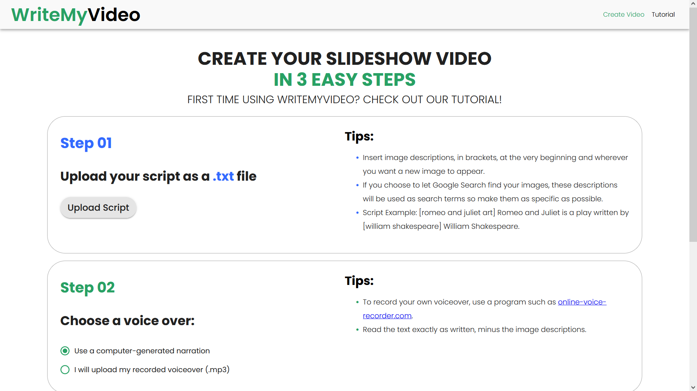

# WriteMyVideo Frontend

The repository for the backend is [here](https://github.com/joshchen984/WriteMyVideo-Backend).

WriteMyVideo's purpose is to help people create videos quickly and easily by simply typing out the video’s script and a description of images to include in the video.

<kbd>

</kbd>

## Development

Create the file `.env.local` and put this in it:

```
NEXT_PUBLIC_API_URL=http://localhost:3001
NEXT_PUBLIC_GA_ID=Google analytics id
```

To run the development server:

```bash
npm run dev
# or
yarn dev
```

Open [http://localhost:3000](http://localhost:3000) with your browser to see the result.

## Services

- deployed on netlify
- domain managed on cloudflare
- Created using Next.js
